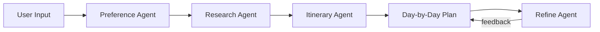

# AI Travel Itinerary Agent — Walkthrough

## What Was Built

A full-stack Next.js application that turns travel preferences into day-by-day itineraries via a multi-step **Gemini AI agent pipeline**.

---

## Architecture

| Layer           | Tech                     | Key Files                                                                                                                                |
| --------------- | ------------------------ | ---------------------------------------------------------------------------------------------------------------------------------------- |
| **Frontend**    | Next.js 16 + React + MUI | `src/components/layout/HomePage.tsx`, `src/components/features/trip/TripForm.tsx`, `src/components/features/itinerary/ItineraryView.tsx` |
| **API**         | Next.js API Routes       | `src/app/api/plan-trip/route.ts`, `src/app/api/refine-trip/route.ts`, `src/app/api/regenerate-day/route.ts`                              |
| **Agent Logic** | Google Gemini 2.0 Flash  | `src/lib/agents.ts`, `src/lib/prompts.ts`                                                                                                |
| **Types**       | TypeScript               | `src/lib/types.ts`                                                                                                                       |
| **Theme**       | MUI Dark Mode            | `src/theme/theme.ts`                                                                                                                     |

---

## Screens

### Screen A — Trip Setup

Full-featured form with free-form prompt, guided fields, travel style chips, budget slider, pace selector, and advanced preferences.

### Screen B — Itinerary View

Summary banner with destination, dates, cost, and interest chips. Day-by-day accordion with morning/afternoon/evening blocks, activity cards with category icons, cost badges, and tags. Includes "Regenerate Day" button, "Refine" text input, and "Agent Log" sidebar.

### Screen C — Export & Share

Copy as plain text, copy as Markdown (for Notion), and print-friendly view.

---

## Agentic Workflow

The app uses a multi-step agent pipeline, visible to the user via the Agent Log sidebar:

1. **Preference Agent** — Normalizes free-form and structured user input into a `TripProfile` JSON.
2. **Research Agent** — Generates candidate activities aligned with interests, budget, and pace.
3. **Itinerary Agent** — Packs activities into morning/afternoon/evening blocks, ensuring variety and budget adherence.
4. **Refine Agent** — Applies targeted user feedback ("more food, less museums") without recreating the whole plan.

Each agent is a distinct function calling Google Gemini with schema-guided prompts.

---

## Verification Results

| Test                                     | Status                     |
| ---------------------------------------- | -------------------------- |
| Page loads at localhost:3000             | ✅                         |
| Trip form renders all fields             | ✅                         |
| "Plan My Trip" generates itinerary       | ✅ (mock data, no API key) |
| Itinerary day accordion + activity cards | ✅                         |
| Agent Log sidebar opens                  | ✅                         |
| Refine input visible                     | ✅                         |
| Export panel visible                     | ✅                         |
| No console errors                        | ✅                         |
